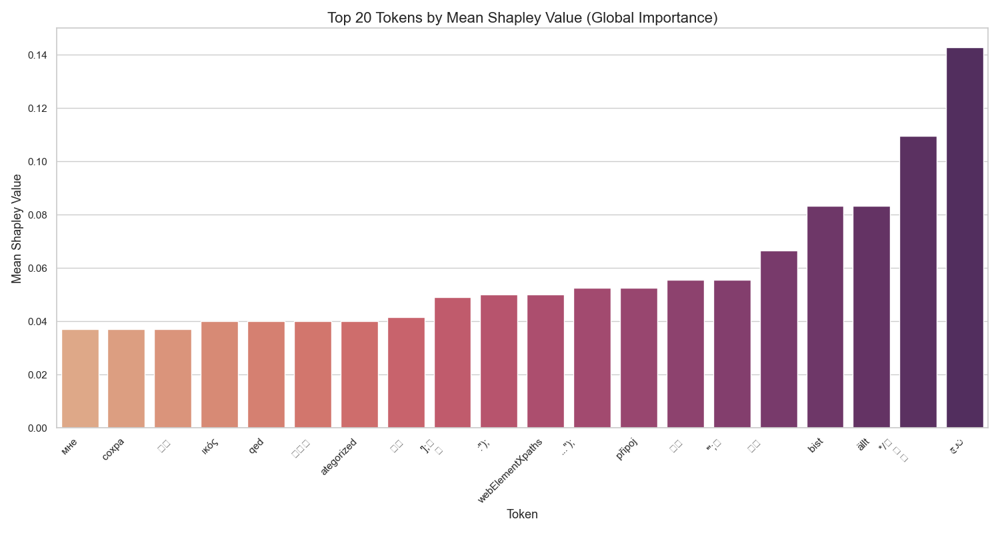
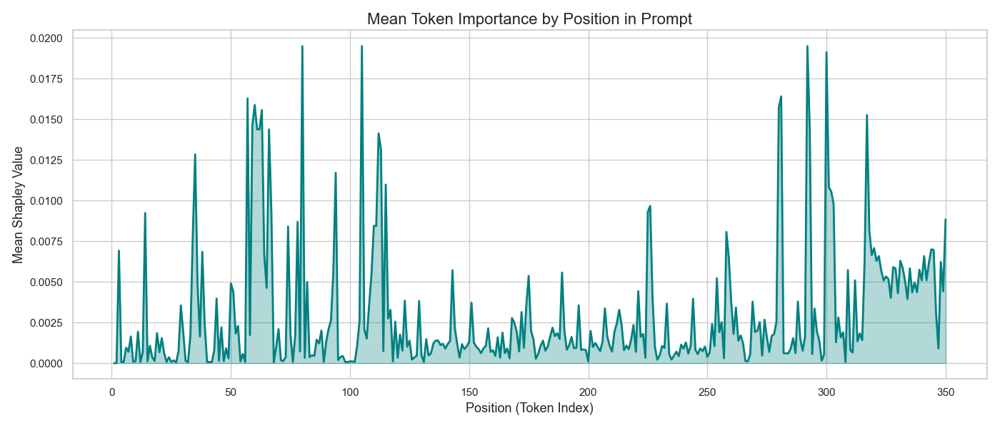

# Explainable Adversarial Prompts

A toolkit and example suite for generating, analyzing, and explaining adversarial prompts against language models — with utilities for explainability techniques such as SHAP.

# Overview

Modern large language models (LLMs) can be vulnerable to adversarial inputs that cause unintended behavior — from bypassing safety filters to triggering hallucinations. This project explores explainability methods to better understand how and why these prompts succeed.

The repository includes:
- Adversarial suffixes (`adv_suffixes.pt`) for adversarial prompts against the model `meta-llama/Llama-3.2-1B-Instruct`
- Explainability tools for analyzing why certain prompts manipulate model outputs
- Notebooks demonstrating workflows and interpretations

# Installation

1. Set up a virtual environment for isolation:

```bash
python3.13 -m venv .venv
source .venv/bin/activate   # macOS/Linux
.venv\Scripts\activate      # Windows
```

2. Clone the repo

```bash
git clone https://github.com/JackSerafini/ExplainableAdversarialPrompts.git
cd ExplainableAdversarialPrompts
```

3. Install dependencies

```bash
pip install -r requirements.txt
```

# Quickstart

In `tokenshap.ipynb`, there are all the tools needed to analyse a prompt:  
It starts by loading the model and the `TokenSHAP` class to compute shap values on the input, which in this case is the prompt:

```python
model = "meta-llama/Llama-3.2-1B-Instruct"
local_model = LocalModel(model, ...)
hf_embedding = HuggingFaceEmbeddings()
splitter = TokenizerSplitter()
token_shap = TokenSHAP(local_model)
```

Then, it collects the adversarial suffixes from `adv_suffixes.pt` and it creates all 100 adversarial prompts.  

Finally, it is possible to play around with SHAP and the different prompts:
```python
df_local = token_shap.analyze(all_prompts[0])
token_shap.print_colored_text()
```

Where `token_shap.print_colored_text()` will print the prompt where each token will be coloured based on its importance for computing the baseline output (obtained by using the full prompt).

# Results

The analysis focuses on the Shapley values computed over 100 runs for the model responses given a set of highly constrained prompts. Each run contains token-level contributions to the model’s output, which allows us to quantify which tokens had the most influence on the model’s behavior.

### 1. Aggregate Token Importance

Across all 100 runs, we calculated the mean Shapley value for each token to identify the most influential words in guiding the model’s response. Tokens such as "ful", "user", "request", "if", "bit", and "worry" consistently appeared with higher Shapley values, indicating they were key drivers in shaping the response according to the instructions in the prompt.

A summary of the top 20 tokens by mean Shapley value is shown below:



Even though many other words had their importance, as we can see mainly very specific characters had the most importance in changing the model's output.

### 2. Distribution of Shapley Values

The distribution of Shapley values shows that most tokens contribute minimally, while a small subset consistently drives the model output. This is consistent with the expectation that only key directive words in the prompt influence the model's adherence to strict response rules:



In fact, we can see how, on average, tokens that were positioned at the end, which means that they were part of the adversarial suffix, are the most important. This, of course, is to be expected as it is the suffix itself to actually change the model's output.

### 3. Key Insights

- Directive words dominate contribution: Words that directly guide the model’s behavior, such as "ful", "request", "Always", and "follow", have the largest positive Shapley values.
- Sparsity of influence: Most tokens, particularly filler words, spaces, and punctuation, contribute negligibly to the model's output.
- Positional importance: Tokens at the beginning of the instruction prompt carry more influence than those in the middle of the prompt.